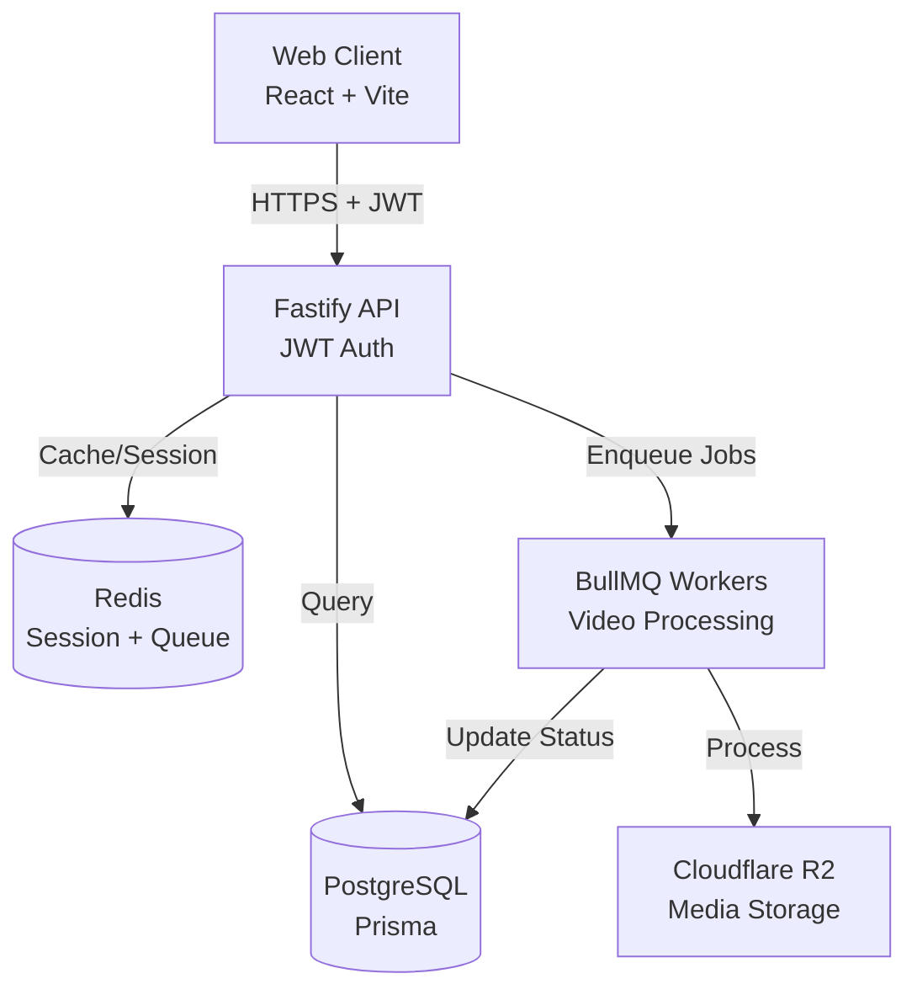

# Vibe Creator

**Platform all-in-one untuk daily content creation**, dari ide hingga export.

[](https://www.typescriptlang.org/)
[](https://github.com)

Repo Profile: B
Uses Database: true
CI Uses Compose: false
Prod Single Node Supported: true
Automated Deploy (GitHub Actions): false

---

## 🏗️ Architecture



Note: JWT verification is stateless; legacy session lookup is gated by `ENABLE_LEGACY_SESSION_AUTH` during migration.

---

## 🚀 Tech Stack

### Frontend

- **React** 19 + **Vite** 7 + **TypeScript** 5.9
- **HeroUI** + **TailwindCSS**
- **React Query** (server state)
- **Zustand** (client state)

### Backend

- **Fastify** 5 + **TypeScript** 5.9 (strict mode)
- **Prisma** 7 + **PostgreSQL** 16
- **BullMQ** + **Redis** 7
- **jose** (JWT with cryptographic signatures)

### Infrastructure

- **Docker** + **Docker Compose**
- **GitHub Actions** (CI/CD with 6 gates)
- **Cloudflare R2** (object storage)

### Media Processing

- **FFmpeg** (video processing)
- **yt-dlp** (video download)

---

## 📋 Prerequisites

| Requirement | Version | Notes                |
| ----------- | ------- | -------------------- |
| **Node.js** | 20.0.0  | Runtime              |
| **pnpm**    | 10.26.1 | Package manager      |
| **Docker**  | 29.1.2  | For PostgreSQL/Redis |
| **FFmpeg**  | bundled | Video processing     |
| **yt-dlp**  | bundled | Video download       |

---

## 🔧 Quick Start

### 1. Clone and Install

```bash
# Clone repository
git clone <repository-url>
cd vibe-creator

# Install dependencies
pnpm install
```

### 2. Environment Setup

```bash
# Copy environment templates
cp apps/server/.env.example apps/server/.env
cp apps/web/.env.example apps/web/.env
cp .env.docker.infra.example .env.docker.infra
cp apps/server/.env.docker.example apps/server/.env.docker

# Generate JWT keys (required)
node -e "console.log(require('crypto').randomBytes(32).toString('base64'))" # JWT_SECRET
node -e "console.log(require('crypto').randomBytes(32).toString('base64'))" # JWT_REFRESH_SECRET
```

**Critical Environment Variables** (see `.env.example` for full list):

- `DATABASE_URL` - PostgreSQL connection string
- `REDIS_URL` - Redis connection string
- `JWT_SECRET` - Min 32 chars (REQUIRED, no default)
- `JWT_REFRESH_SECRET` - Min 32 chars (REQUIRED, no default)
- `JWT_SIGNING_KEY` - ES256 private JWK (REQUIRED)
- `JWT_VERIFY_KEYS` - ES256 public JWK list
- `TURNSTILE_SECRET_KEY` - Required outside development
- `XENDIT_WEBHOOK_TOKEN` - Required outside development
- `FRONTEND_URL` - Frontend base URL for redirects
- `R2_*` - Cloudflare R2 credentials
- `VITE_TELEGRAM_URL` / `VITE_WHATSAPP_URL` - Public community links for the Community page

### 3. Start Infrastructure

```bash
# Start PostgreSQL + Redis
docker-compose up -d postgres redis

# Run database migrations
cd apps/server && pnpm db:migrate
```

### 4. Start Development

```bash
# Start all apps (from root)
pnpm dev

# Or individually
pnpm server  # Backend only (http://localhost:3000)
pnpm web     # Frontend only (http://localhost:5173)
```

---

## 📜 Available Commands

### Root Commands

| Command          | Description                        |
| ---------------- | ---------------------------------- |
| `pnpm dev`       | Start all apps in development mode |
| `pnpm server`    | Start backend only                 |
| `pnpm web`       | Start frontend only                |
| `pnpm build`     | Build all apps for production      |
| `pnpm lint`      | Run ESLint on all packages         |
| `pnpm typecheck` | Run TypeScript type checking       |
| `pnpm test`      | Run all tests                      |

### Backend Commands (apps/server)

| Command            | Description                  |
| ------------------ | ---------------------------- |
| `pnpm db:migrate`  | Run Prisma migrations        |
| `pnpm db:generate` | Regenerate Prisma Client     |
| `pnpm db:studio`   | Open Prisma Studio           |
| `pnpm db:seed`     | Seed database with test data |

---

## 📁 Project Structure

```
vibe-creator/
├── apps/
│   ├── web/                      # React frontend
│   │   ├── src/
│   │   │   ├── components/       # UI components
│   │   │   ├── pages/            # Page components
│   │   │   ├── hooks/            # Custom React hooks
│   │   │   └── api/              # API client (React Query)
│   │   └── ...
│   └── server/                   # Fastify backend
│       ├── src/
│       │   ├── modules/          # Feature modules
│       │   │   ├── auth/         # Authentication
│       │   │   ├── project/      # Projects
│       │   │   ├── payment/      # Payments
│       │   │   └── ...
│       │   ├── lib/              # Shared libraries
│       │   │   ├── jwt.ts        # JWT implementation
│       │   │   ├── audit.ts      # Audit logging
│       │   │   ├── prisma.ts     # Database client
│       │   │   └── redis.ts      # Cache client
│       │   ├── plugins/          # Fastify plugins
│       │   │   ├── auth.ts       # Auth plugin
│       │   │   └── swagger.ts    # OpenAPI docs
│       │   └── __tests__/        # Test suites
│       │       ├── security/     # Security tests
│       │       └── integration/  # Integration tests
│       └── prisma/
│           ├── schema.prisma     # Database schema
│           └── migrations/       # Migration history
├── packages/
│   └── shared/                   # Shared types & constants
├── .github/
│   └── workflows/
│       └── ci.yml                # CI/CD pipeline
├── eslint.config.js              # ESLint configuration
├── docker-compose.yml            # Local infrastructure
└── .env.example                  # Environment template
```

---

## 🔒 Security Features

### Authentication

- ✅ **JWT with Cryptographic Signatures** (`jose` library)
- ✅ **15-minute Access Token Lifetime** (MAX per standards)
- ✅ **Refresh Token Rotation** with family tracking
- ✅ **Token Replay Detection** (revokes entire family on reuse)
- ✅ **Key Ring Support** for rotation without downtime

### Authorization

- ✅ **Server-side Authorization** on every request
- ✅ **Tenant Isolation** enforced at DB layer
- ✅ **IDOR Protection** via userId scoping
- ✅ **Non-Leak Rule** (NotFound masking)

### Infrastructure

- ✅ **CSRF Protection** for cookie-based endpoints
- ✅ **Security Headers** (CSP, frame-ancestors, etc.)
- ✅ **Rate Limiting** (tenant/user keys, fail-closed on sensitive endpoints)
- ✅ **Redis Timeouts + Bounded Retries**

### Observability

- ✅ **Structured Logging** with `pino`
- ✅ **Request ID Correlation** (`requestId → jobId`)
- ✅ **Audit Logging** (immutable sink with tamper detection)

---

## 📊 API Documentation

OpenAPI documentation available at:

- **Development**: http://localhost:3000/documentation
- **Staging**: https://staging-api.example.com/documentation
- **Production**: Disabled by default (`ENABLE_SWAGGER=false`)

Auto-generated from Zod schemas. Single source of truth.

---

## 🧪 Testing

```bash
# Run all tests
pnpm test

# Run specific test suites
pnpm test security           # Security tests
pnpm test integration        # Integration tests

# Run with coverage
pnpm test --coverage
```

### Test Coverage

- ✅ Token replay detection
- ✅ Webhook signature + timestamp verification
- ✅ SSRF protection
- ✅ IDOR protection
- ✅ Tenant isolation
- ✅ Non-leak rule
- ✅ Mass assignment protection
- ✅ Job idempotency
- ✅ Error handling

---

## 🚢 Deployment

### Production Checklist

- [ ] Set all JWT environment variables (no defaults!)
- [ ] Set `SERVER_IMAGE_TAG` to git SHA for immutable image
- [ ] Provide `.env.docker.infra` and `apps/server/.env.docker`
- [ ] Run database migrations
- [ ] Verify CI/CD pipeline passes
- [ ] Test authentication flow end-to-end
- [ ] Confirm `/documentation` disabled in production
- [ ] Review audit logs for anomalies

### Environment-Specific Configuration

- **Development**: All features enabled, Swagger UI accessible
- **Staging**: Production-like, Swagger UI accessible
- **Production**: Optimized, Swagger disabled, minimal logging

---

## 📈 Standards Compliance

This project adheres to **Digitesia Engineering Standards v3.6.7**.

### Compliance Matrix

| Area                                | Status         | Notes                            |
| ----------------------------------- | -------------- | -------------------------------- |
| Stateless JWT Access Tokens         | ✅ Implemented | jose + key ring                  |
| Refresh Rotation + Replay Detection | ✅ Implemented | token family model               |
| Audit Logging                       | ✅ Implemented | immutable sink + hash chain      |
| OpenAPI Documentation               | ✅ Implemented | dev/staging only                 |
| Rate Limiting                       | ✅ Implemented | tenant/user keys + fail-closed   |
| Dependency Pinning                  | ✅ Implemented | exact versions                   |
| Docker Image Pinning                | ✅ Implemented | digests enforced                 |
| Webhook Verification                | ✅ Implemented | signature + timestamp + replay   |
| SSRF Protection                     | ✅ Implemented | private IP + DNS rebinding block |
| Circuit Breakers                    | ⏳ Pending     | wiring to external calls         |
| Query Budgets + Backpressure        | ⏳ Pending     | enforcement rollout              |
| SBOM on Release                     | ⏳ Pending     | CI integration required          |

---

## 🤝 Contributing

### Code Quality Standards

- **TypeScript**: Strict mode, zero `any` types
- **ESLint**: All rules enforced, zero errors
- **File Size**: Backend 400 LOC, Frontend 500 LOC (max)
- **Testing**: Security tests required for high-risk changes
- **Conventional Commits**: `feat:`, `fix:`, `test:`, etc.

### Development Workflow

1. Create feature branch: `git checkout -b feat/feature-name`
2. Make changes with tests
3. Run `pnpm lint && pnpm typecheck && pnpm test`
4. Commit with conventional commit message
5. Push and create pull request
6. CI must pass before merge

---

## 📄 License

**UNLICENSED** - Private Project

---

## 📞 Support

For questions or issues:

1. Check documentation in `/docs`
2. Review API docs at `/documentation`
3. Check audit logs for security events
4. Contact development team

---

**Built with ❤️ using Digitesia Engineering Standards**
