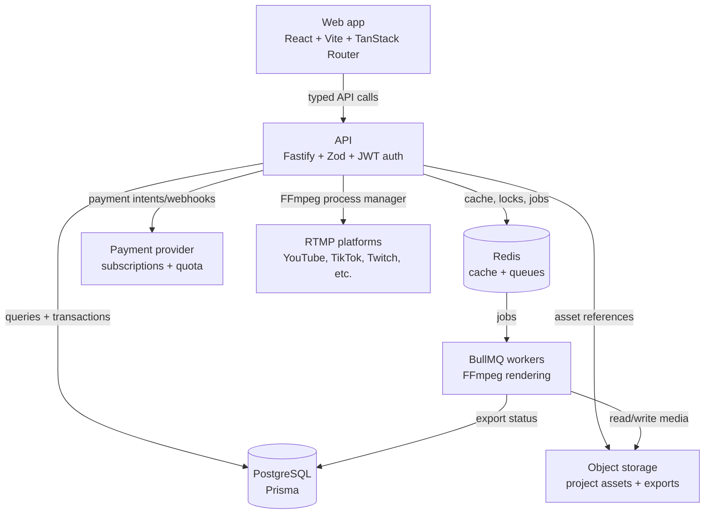

# Vibe Creator

Vibe Creator is an open-source, full-stack TypeScript workspace for modern
creator-video workflows. It brings trend discovery, AI-assisted short creation,
timeline editing, long-loop generation, reaction recording, live streaming,
exports, and project history into one production-oriented web app.

The repository is useful for developers who want to study or extend a realistic
video SaaS architecture: typed React UI, Fastify APIs, secure auth, persistent
project assets, background media jobs, billing/quota flows, admin operations,
and FFmpeg-based rendering.

## Project Status

Vibe Creator is in early public alpha. The codebase is actively maintained, but
APIs, feature boundaries, environment variables, and deployment details may still
change before a stable release.

Current focus areas:

- Improve local setup and first-run documentation.
- Document media, FFmpeg, export, and streaming workflows.
- Add contributor-friendly issues and examples.
- Expand deterministic tests for auth, ownership checks, jobs, media pipelines,
  billing/quota, and webhooks.
- Prepare the first tagged alpha release.

## Repository Profile

- Repo Profile: B
- Uses Database: true
- CI Uses Compose: true
- Prod Single Node Supported: true
- Automated Deploy (GitHub Actions): true

## Core Features

- AI Director: import a video or trending YouTube link, analyze it, and prepare
  short-form output.
- Video Studio: timeline editor with layers, text, media assets, canvas
  backgrounds, transforms, and export.
- Loop Creator: turn a ready-made ambience or relaxing video into a longer loop
  with seamless-loop support.
- Reaction Recorder: upload or record a reaction while watching the main video,
  then render picture-in-picture or side-by-side output.
- Live Streaming: stream one source video in a loop to RTMP platforms with
  quota, process lifecycle, and history tracking.
- Trending: YouTube-first viral video discovery by country, with CTA handoff to
  AI Director.
- Workspace History: continue active drafts, download available exports, and see
  lifecycle status.
- Admin Console: user, subscription, announcement, and operational controls.

## Architecture



## Tech Stack

### Frontend

- React 19, Vite 7, TypeScript 5.9
- TanStack Router for typed file-based routing
- TanStack Query for server state
- Zustand for scoped client state
- Tailwind CSS, Radix primitives, Lucide icons
- Vitest and Playwright

### Backend

- Fastify 5, TypeScript 5.9, Zod validation
- Prisma 7 and PostgreSQL
- Redis and BullMQ for cache, queues, and background jobs
- jose and argon2 for authentication
- FFmpeg and yt-dlp/cobalt-style media ingestion paths
- Pino logging, audit events, rate limits, and security headers

### Infrastructure

- pnpm workspaces
- Docker Compose for local infrastructure and single-node deployment
- Cloud/object storage for media assets and exports

## Prerequisites

| Requirement | Version | Notes |
| --- | --- | --- |
| Node.js | 20+ | Runtime required by the workspace |
| pnpm | 10.26.1 | Pinned in `packageManager` |
| Docker | 29+ recommended | PostgreSQL, Redis, and local services |
| FFmpeg | system or container | Required for media processing |
| Python 3 | 3.10+ recommended | Used by some media helper scripts |

## Quick Start

### 1. Clone and install

```bash
git clone https://github.com/aldrndev/vibe-creator.git
cd vibe-creator
pnpm install
```

### 2. Configure environment files

```bash
cp apps/api/.env.example apps/api/.env
cp apps/web/.env.example apps/web/.env
cp infra/compose/.env.docker.infra.example infra/compose/.env.docker.infra
```

Important environment groups:

- Database and cache: `DATABASE_URL`, `REDIS_URL`
- Auth: `JWT_SECRET`, `JWT_REFRESH_SECRET`, signing key material
- Frontend: `VITE_API_URL`, public feature/config values
- Uploads/storage: object storage credentials and bucket names
- Payments: payment provider keys and webhook token
- Community: `VITE_TELEGRAM_URL`, `VITE_WHATSAPP_URL`
- Live streaming: quota and RTMP/process settings

Never commit real `.env` files or secrets.

### 3. Start local infrastructure

```bash
pnpm docker:infra:up
```

This starts the local PostgreSQL, Redis, and supporting services defined in
`infra/compose/docker-compose.dev.yml`.

### 4. Prepare the API

```bash
pnpm db:generate
pnpm db:migrate
pnpm api:python:setup
```

`pnpm api:python:setup` is only needed when you want to run media helper paths
that depend on the API Python environment.

### 5. Run the app

```bash
pnpm dev
```

Or run each app separately:

```bash
pnpm api
pnpm web
```

Default local URLs:

- Web: `http://localhost:5173`
- API: `http://localhost:3000`

## Commands

| Command | Description |
| --- | --- |
| `pnpm dev` | Run all workspace apps in development mode |
| `pnpm web` | Run only the web app |
| `pnpm api` | Run only the API |
| `pnpm build` | Build all workspace packages |
| `pnpm lint` | Run Biome checks across packages |
| `pnpm typecheck` | Run TypeScript checks |
| `pnpm test` | Run test suites |
| `pnpm db:generate` | Generate Prisma client |
| `pnpm db:migrate` | Run Prisma migrations in development |
| `pnpm db:studio` | Open Prisma Studio |
| `pnpm docker:infra:up` | Start local PostgreSQL, Redis, and support services |
| `pnpm docker:infra:down` | Stop local infrastructure services |
| `pnpm docker:prod:up` | Start the production single-node compose stack |
| `pnpm layout:check` | Run layout consistency checks |

## Project Structure

```text
vibe-creator/
  apps/
    api/                 Fastify API, Prisma schema, workers, modules
    web/                 React/Vite app, routes, pages, components
  packages/
    shared/              Shared types, constants, and Zod schemas
  infra/
    compose/             Development and production compose files
    deploy/single-node/  VPS deployment notes and scripts
    scripts/             Infrastructure validation helpers
  docs/                  Product and implementation documentation
  .agents/rules/         Engineering rules used by AI/code agents
  PROJECT.yaml           Project contract and quality gates
```

## Quality Gates

The repository is governed by `PROJECT.yaml` and `.agents/rules/`. Before
merging production changes, run the relevant gates:

```bash
pnpm lint
pnpm typecheck
pnpm test
pnpm build
```

Logic changes should include tests. API contracts and user input must be
validated with Zod. TypeScript `any`, unchecked secrets, raw user-facing error
details, and direct frontend `fetch` calls are not accepted.

## Security Model

Vibe Creator includes high-risk surfaces: user auth, project assets, file
uploads, FFmpeg workers, export downloads, RTMP stream keys, quota/billing, and
admin actions. The project follows these security principles:

- Server-side authorization on every protected resource.
- Zod validation for API input and output.
- HttpOnly cookie-based auth and refresh-token rotation.
- No stream keys, tokens, passwords, or webhook payloads in logs.
- Ownership-safe download/export/stream endpoints.
- SSRF and private-network protections for user-provided URLs.
- Soft-delete/suspend patterns for admin-managed users.
- Audit logging for sensitive admin and account actions.

If you find a security issue, do not open a public exploit issue. See
`CONTRIBUTING.md` for responsible disclosure guidance.

## Open Source Roadmap

This repository is intended to be a transparent reference implementation for
creator-video SaaS workflows. Near-term open-source work includes:

- Add screenshots or a short demo walkthrough.
- Publish the first `v0.1.0-alpha` release.
- Create `good first issue` tasks for setup, docs, examples, and tests.
- Improve setup diagnostics for local PostgreSQL, Redis, FFmpeg, and Python
  helper dependencies.

## Deployment

The production deployment target is a single-node VPS using Docker Compose and
Nginx. Start with:

- `infra/compose/docker-compose.prod.single-node.yml`
- `infra/deploy/single-node/README.md`
- `infra/deploy/single-node/nginx.conf`

Production secrets must be injected at runtime through environment variables or
server-side secret management. Do not bake `.env` files into images.

## Contributing

See `CONTRIBUTING.md` for setup, coding standards, testing expectations,
security reporting, and pull request guidelines.

## License

Vibe Creator is released under the MIT License. See `LICENSE` for details.
