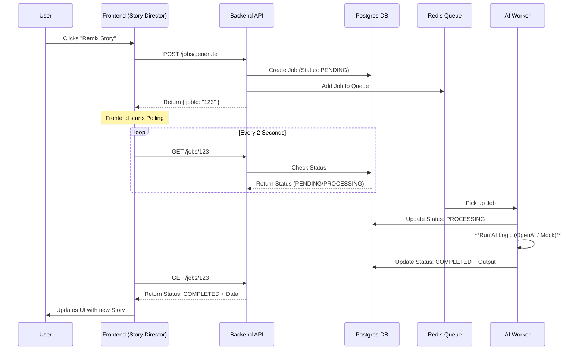

# AI Director Architecture: Async Job Queue

This document explains how the **AI Story Director** functions behind the scenes. We use an **Asynchronous Job Queue** architecture to handle AI generation.

## Why Async?

AI generation (e.g., generating a story structure or video) allows takes time (3s to 30s+). If we made the user wait for a standard HTTP request, the browser would likely timeout or freeze.

## The Workflow

## Components

### 1. Frontend (The Trigger)

- **File**: `DirectorPanel.tsx`
- **Action**: When you click "Remix", it doesn't wait for the final result. It sends a signal to start the work and immediately gets a `jobId` ticket back.
- **Polling**: It uses the `useJobPolling` hook to check the status of that ticket every 2 seconds.

### 2. The Queue (The Manager)

- **Tech**: BullMQ + Redis.
- **Role**: This acts like a waiting room. If 100 users click "Generate" at once, the queue lines them up so the server doesn't crash.

### 3. The Worker (The Brain)

- **File**: `queue.ts`
- **Role**: A background process that picks tasks up one by one.
- **Current State**: Since you don't have an API Key, we are running in **Mock Mode**.
  - It simulates "thinking" for 3 seconds.
  - It returns a pre-written "Cyberpunk Studio" story structure.

### 4. The Database (The Memory)

- **Table**: `Job`
- **Role**: Stores the history and result of every job. This ensures that even if you refresh the page, we know the status of your request.
