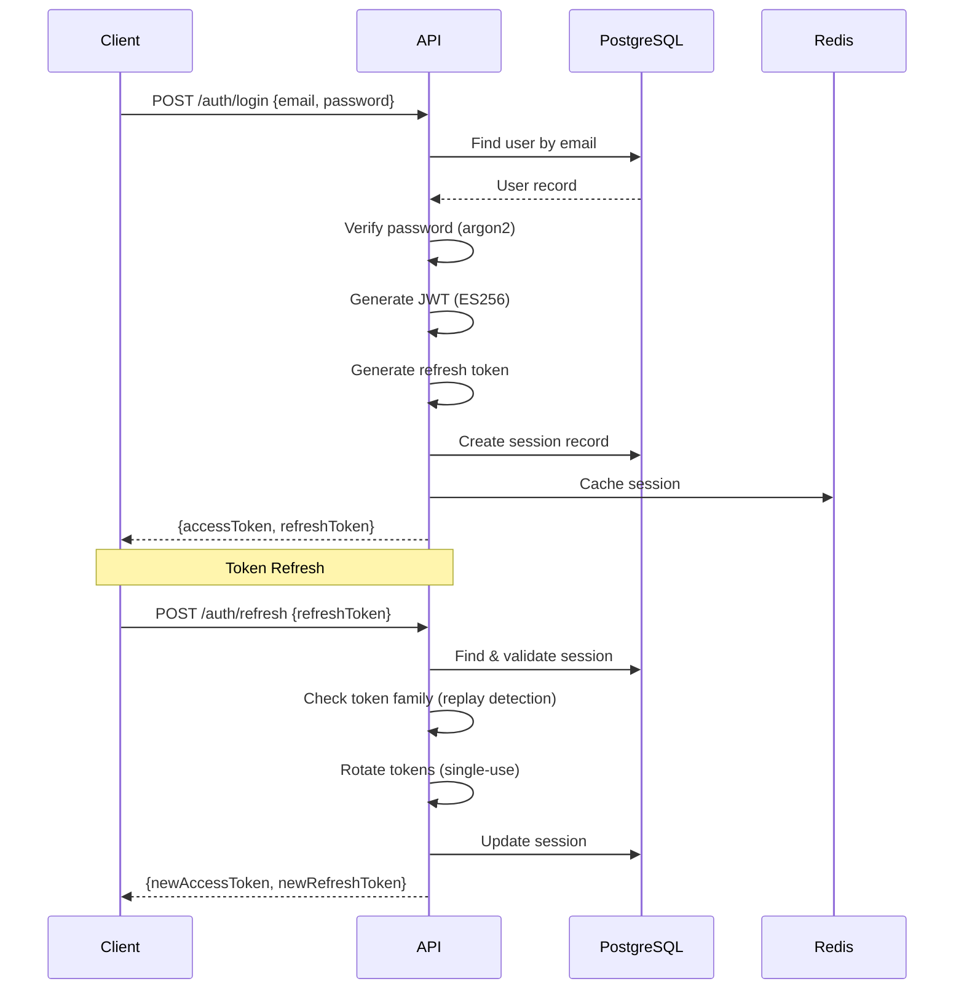
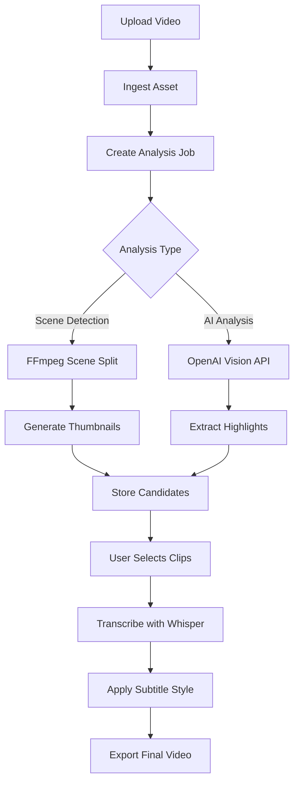
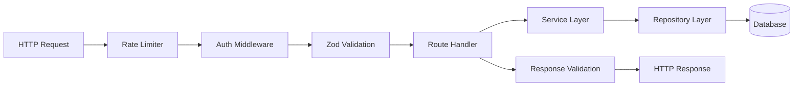
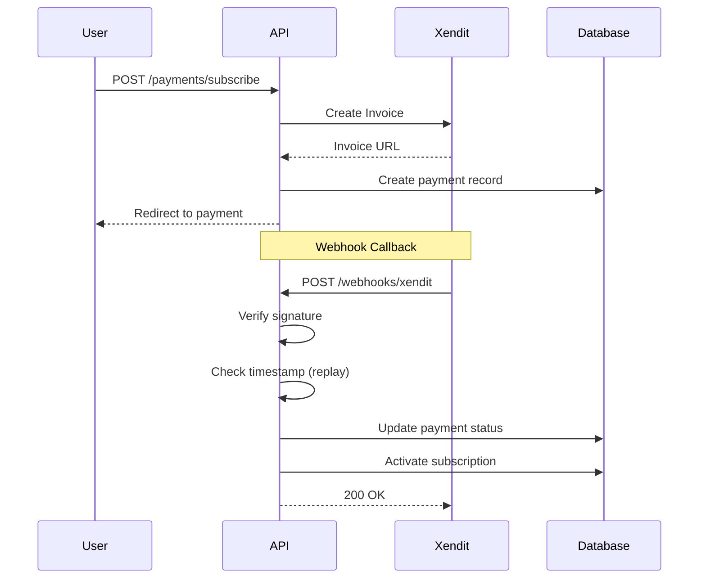

# Data Flow

## Authentication Flow

```mermaid
sequenceDiagram
    participant C as Client
    participant A as API
    participant DB as PostgreSQL
    participant R as Redis

    C->>A: POST /auth/login {email, password}
    A->>DB: Find user by email
    DB-->>A: User record
    A->>A: Verify password (argon2)
    A->>A: Generate JWT (ES256)
    A->>A: Generate refresh token
    A->>DB: Create session record
    A->>R: Cache session
    A-->>C: {accessToken, refreshToken}

    Note over C,A: Token Refresh
    C->>A: POST /auth/refresh {refreshToken}
    A->>DB: Find & validate session
    A->>A: Check token family (replay detection)
    A->>A: Rotate tokens (single-use)
    A->>DB: Update session
    A-->>C: {newAccessToken, newRefreshToken}
```

## Video Export Pipeline

```mermaid
flowchart LR
    subgraph "Request Phase"
        A[Client Request] --> B[Validate Input]
        B --> C[Check Rate Limit]
        C --> D[Create Job Record]
    end

    subgraph "Queue Phase"
        D --> E[Enqueue to BullMQ]
        E --> F[Worker Picks Job]
    end

    subgraph "Processing Phase"
        F --> G[Download Assets]
        G --> H[Build FFmpeg Command]
        H --> I[Execute FFmpeg]
        I --> J[Upload to R2]
    end

    subgraph "Completion Phase"
        J --> K[Update Job Status]
        K --> L[Generate Signed URL]
        L --> M[Notify Client]
    end
```

## AI Director Flow

```mermaid
flowchart TB
    A[Upload Video] --> B[Ingest Asset]
    B --> C[Create Analysis Job]
    C --> D{Analysis Type}

    D -->|Scene Detection| E[FFmpeg Scene Split]
    D -->|AI Analysis| F[OpenAI Vision API]

    E --> G[Generate Thumbnails]
    F --> H[Extract Highlights]

    G --> I[Store Candidates]
    H --> I

    I --> J[User Selects Clips]
    J --> K[Transcribe with Whisper]
    K --> L[Apply Subtitle Style]
    L --> M[Export Final Video]
```

## API Request Flow

```mermaid
flowchart LR
    A[HTTP Request] --> B[Rate Limiter]
    B --> C[Auth Middleware]
    C --> D[Zod Validation]
    D --> E[Route Handler]
    E --> F[Service Layer]
    F --> G[Repository Layer]
    G --> H[(Database)]

    E --> I[Response Validation]
    I --> J[HTTP Response]
```

## Payment Flow

```mermaid
sequenceDiagram
    participant U as User
    participant A as API
    participant X as Xendit
    participant DB as Database

    U->>A: POST /payments/subscribe
    A->>X: Create Invoice
    X-->>A: Invoice URL
    A->>DB: Create payment record
    A-->>U: Redirect to payment

    Note over X,A: Webhook Callback
    X->>A: POST /webhooks/xendit
    A->>A: Verify signature
    A->>A: Check timestamp (replay)
    A->>DB: Update payment status
    A->>DB: Activate subscription
    A-->>X: 200 OK
```
