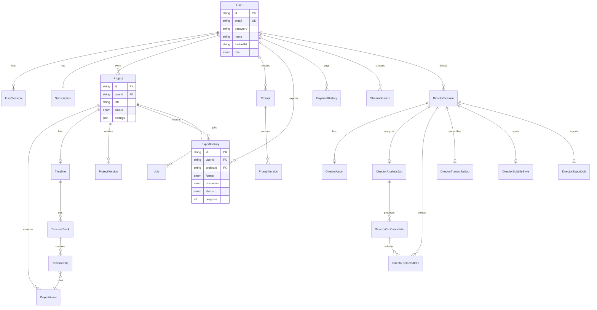

# Database Schema

## Entity Relationship Diagram

## Core Tables

### User & Auth

| Table             | Purpose                          |
| ----------------- | -------------------------------- |
| `users`           | User accounts                    |
| `user_sessions`   | JWT sessions with refresh tokens |
| `subscriptions`   | Subscription tiers               |
| `payment_history` | Payment records                  |

### Project & Timeline

| Table              | Purpose              |
| ------------------ | -------------------- |
| `projects`         | User projects        |
| `project_assets`   | Uploaded media files |
| `timelines`        | Timeline settings    |
| `timeline_tracks`  | Video/audio tracks   |
| `timeline_clips`   | Individual clips     |
| `project_versions` | Version snapshots    |

### Export & Processing

| Table            | Purpose            |
| ---------------- | ------------------ |
| `export_history` | Export job records |
| `download_jobs`  | URL download tasks |
| `jobs`           | Async job queue    |

### AI Director

| Table                      | Purpose         |
| -------------------------- | --------------- |
| `director_sessions`        | Wizard sessions |
| `director_assets`          | Source videos   |
| `director_analysis_jobs`   | Scene analysis  |
| `director_clip_candidates` | Detected clips  |
| `director_selected_clips`  | User selections |
| `director_transcribe_jobs` | Whisper jobs    |
| `director_export_jobs`     | Final exports   |

### Streaming

| Table                   | Purpose         |
| ----------------------- | --------------- |
| `stream_sessions`       | Live streams    |
| `stream_quota_cycles`   | Usage tracking  |
| `billing_subscriptions` | Billing records |

## Indexes

Critical indexes for performance:

- `users.email` - Login lookups
- `user_sessions.token` - Token validation
- `user_sessions.refreshToken` - Refresh flow
- `projects.userId` - User's projects
- `export_history.userId, status` - Job status
- `director_sessions.userId` - User sessions
