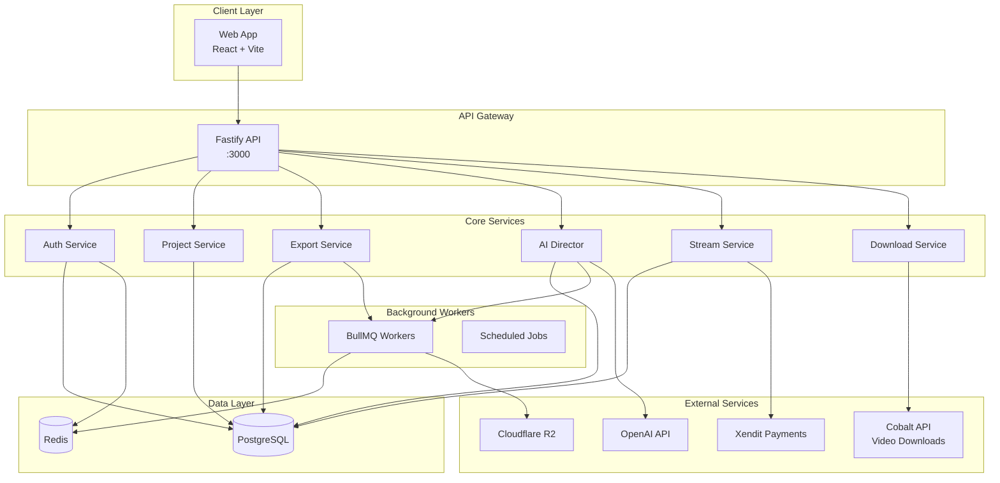

# System Overview

## Architecture Diagram



## Components

### Web Application (apps/web)

- **Framework**: React 19 + Vite
- **State**: Zustand (client) + React Query (server)
- **UI**: Radix UI + Tailwind CSS
- **Features**: Video Editor, AI Director, Prompt Builder

### API Server (apps/api)

- **Framework**: Fastify + TypeScript
- **Auth**: JWT (ES256) + Refresh Token Rotation
- **Validation**: Zod schemas
- **Database**: Prisma ORM

### Background Processing

- **Queue**: BullMQ + Redis
- **Jobs**: Video export, AI analysis, transcription
- **FFmpeg**: Video processing pipeline

## Directory Structure

```
contencreative/
├── apps/
│   ├── api/          # Backend API
│   │   ├── src/
│   │   │   ├── config/     # Environment config
│   │   │   ├── lib/        # Core libraries
│   │   │   ├── modules/    # Feature modules
│   │   │   ├── plugins/    # Fastify plugins
│   │   │   └── shared/     # Shared utilities
│   │   └── prisma/         # Database schema
│   └── web/          # Frontend app
│       └── src/
│           ├── components/ # UI components
│           ├── features/   # Feature modules
│           ├── lib/        # Utilities
│           └── stores/     # Zustand stores
├── packages/
│   └── shared/       # Shared types/utils
├── infra/
│   ├── compose/      # Docker Compose files
│   ├── scripts/      # Operational scripts
│   └── deploy/       # Deployment configs
└── docs/             # Documentation
```

## Technology Stack

| Layer    | Technology                 |
| -------- | -------------------------- |
| Frontend | React 19, Vite, TypeScript |
| Styling  | Tailwind CSS, Radix UI     |
| Backend  | Fastify, TypeScript        |
| Database | PostgreSQL 16, Prisma 7    |
| Cache    | Redis 7                    |
| Queue    | BullMQ                     |
| Video    | FFmpeg, yt-dlp             |
| AI       | OpenAI GPT-4, Whisper      |
| Storage  | Cloudflare R2              |
| Payments | Xendit                     |
